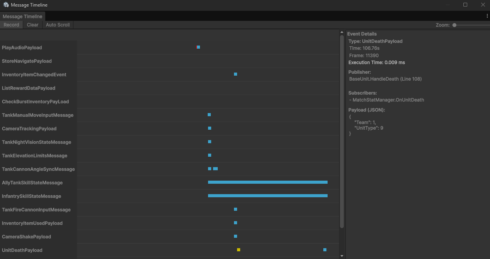

# PirexMessage

**PirexMessage** is a high-performance **Pub/Sub message broker** for Unity, designed with a focus on **zero GC allocation** on the hot path and complete **thread safety**.

---

## ✨ Highlights

### 🚀 Zero GC on the Hot Path
- **`Publish`**: fully zero allocation, zero lock — just a single volatile read + array iteration
- **`Unsubscribe`**: zero allocation via swap-remove (unordered) or shift-remove (ordered)
- **`Subscribe`**: zero allocation after warmup thanks to a **Subscription pool** and **capacity-doubling slot array**

### ⚡ Two Dispatch Modes
| Mode | Unsubscribe cost | Publish order | Recommended for |
|---|---|---|---|
| **Unordered** (default) | O(1) swap-remove | Unspecified | Most in-game events |
| **Ordered** | O(n) shift-remove | Insertion order | UI, animation sequences |

### 🎯 No Boxing, No Closures
- Generic dispatch — value-type `T` is never boxed
- Static `IndexOf` helper — no delegate or closure allocation
- `static` lambda in extension methods — cached automatically by the compiler

---

## 📦 Installation

### Unity Package Manager (Git URL)

In your project's `Packages/manifest.json`, add to `dependencies`:

```json
{
  "dependencies": {
    "com.pirexgames.pirexmessage": "https://github.com/PirexGames/pirex-message.git#1.0.3"
  }
}
```

Replace `1.0.3` with the desired release tag.

### Optional: Enable UniTask Support

Add the scripting define symbol `PIREX_PIPE_UNITASK` in **Project Settings → Player → Scripting Define Symbols** to unlock `PublishAsync`.

> Requires [UniTask](https://github.com/Cysharp/UniTask) to be installed.

---

## 🚀 Usage

### 1. Define a Message

```csharp
// Use structs to avoid heap allocation when publishing
public struct PlayerDiedEvent
{
    public int PlayerId;
    public Vector3 Position;
}

public struct EnemyHitEvent
{
    public float Damage;
}
```

### 2. Subscribe

```csharp
public class EnemyManager : MonoBehaviour
{
    private IDisposable _subscription;

    private void Awake()
    {
        // Unordered (default) — fastest
        _subscription = PirexPipe.Subscribe<PlayerDiedEvent>(OnPlayerDied);

        // Ordered — preserves subscription order
        _subscription = PirexPipe.Subscribe<UIEvent>(OnUIEvent, ordered: true);
    }

    private void OnPlayerDied(PlayerDiedEvent e)
    {
        Debug.Log($"Player {e.PlayerId} died at {e.Position}");
    }

    private void OnDestroy()
    {
        _subscription?.Dispose(); // auto-unsubscribes and returns token to pool
    }
}
```

### 3. Subscribe with `DisposeOnDestroy` (shorthand)

```csharp
private void Awake()
{
    PirexPipe.Subscribe<PlayerDiedEvent>(OnPlayerDied)
             .DisposeOnDestroy(this); // auto-Dispose when MonoBehaviour is destroyed
}
```

### 4. Publish

```csharp
public class PlayerController : MonoBehaviour
{
    private void Die()
    {
        // Zero GC, zero lock
        PirexPipe.Publish(new PlayerDiedEvent
        {
            PlayerId = _id,
            Position = transform.position
        });
    }
}
```

### 5. Conditional Subscription (Filtering)

You can pass a `Predicate<T>` filter to `Subscribe`. The callback will only be invoked if the published payload satisfies the condition. **This retains the zero-allocation hot path.**

```csharp
// Subscriber 1: Only triggered when PlayerId == 1
PirexPipe.Subscribe<PlayerDiedEvent>(
    OnPlayer1Died, 
    filter: e => e.PlayerId == 1
);

// Subscriber 2: Triggered for all deaths
PirexPipe.Subscribe<PlayerDiedEvent>(
    OnAnyPlayerDied
);

// Publisher
PirexPipe.Publish(new PlayerDiedEvent { PlayerId = 1 }); // Both receive
PirexPipe.Publish(new PlayerDiedEvent { PlayerId = 2 }); // Only Subscriber 2 receives
```

### 6. Managing Multiple Subscriptions

```csharp
private readonly List<IDisposable> _subscriptions = new List<IDisposable>();

private void Awake()
{
    _subscriptions.Add(PirexPipe.Subscribe<PlayerDiedEvent>(OnPlayerDied));
    _subscriptions.Add(PirexPipe.Subscribe<EnemyHitEvent>(OnEnemyHit));
}

private void OnDestroy()
{
    foreach (var sub in _subscriptions) sub.Dispose();
    _subscriptions.Clear();
}
```

### 7. Using `Broker<T>` Directly (Advanced)

```csharp
// Create an isolated broker without going through PirexPipe
var broker = new Broker<MyEvent>(ordered: true);

var sub = broker.Subscribe(e => Debug.Log(e));
broker.Publish(new MyEvent());
sub.Dispose();
broker.Dispose();
```

### 8. PublishAsync (requires UniTask)

```csharp
#if PIREX_PIPE_UNITASK
await PirexPipe.PublishAsync(new PlayerDiedEvent { PlayerId = 1 });
#endif
```

### 9. Cleanup

```csharp
// Remove the broker for a specific type
PirexPipe.Cleanup<PlayerDiedEvent>();

// Remove all brokers
PirexPipe.ClearAll();
```

---

## 🛠️ Event Profiler (Timeline)

PirexMessage includes a built-in visual profiler to monitor events in real-time, helping you track down performance bottlenecks and trace event flows.



To open the profiler:
1. Navigate to **Window > PirexGames > PirexMessage Timeline** in the Unity Editor.
2. Ensure the **Record** toggle is enabled (On).
3. Enter Play Mode.

### Features
- **Zero-Allocation Tracking:** The profiling logic is enclosed in `#if UNITY_EDITOR`. It compiles out completely in production builds, guaranteeing 0 impact on your game's performance.
- **Execution Time Visualization:** Events are plotted on a timeline and color-coded based on their total execution time (Dispatch time to all subscribers):
  - 🔵 **Cyan:** < 0.5 ms (Fast)
  - 🟠 **Orange:** 0.5 ms – 2.0 ms (Warning)
  - 🔴 **Red:** > 2.0 ms (Slow - Requires optimization)
- **Publisher Call Stack Tracking:** Click on any event dot to see exactly which Class and Method published the event (including the line number).
- **Active Subscriber List:** The detail panel also reveals which subscribers successfully received the event (respecting any conditional filters).

---

## 📊 Performance Profile

| Operation | GC Alloc | Lock | Complexity |
|---|---|---|---|
| `Publish` | **0** | **0** | O(n) |
| `Unsubscribe` (after warmup) | **0** | SpinLock | O(n) |
| `Subscribe` (after warmup) | **0** | SpinLock | O(n) |
| `Subscribe` (cold / capacity grow) | 1× array | SpinLock | O(n) |
| `PublishParallel` | 1× closure | SpinLock | O(n/cores) |

> **Warmup** = the Subscription pool already holds a recycled object (after the first Dispose) and the slot array has sufficient capacity.

### Estimated throughput (6ms logic budget at 60fps)

| Subscribers per event | Max Publish calls/frame |
|---|---|
| 1 | ~142,000 |
| 10 | ~69,000 |
| 50 | ~20,900 |

---

## 🔧 Requirements

- **Unity**: 2021.3 LTS or newer
- **.NET Standard**: 2.1
- **UniTask** (optional): required for `PublishAsync`
---

## 📄 License

MIT © [PirexGames](https://github.com/PirexGames)
